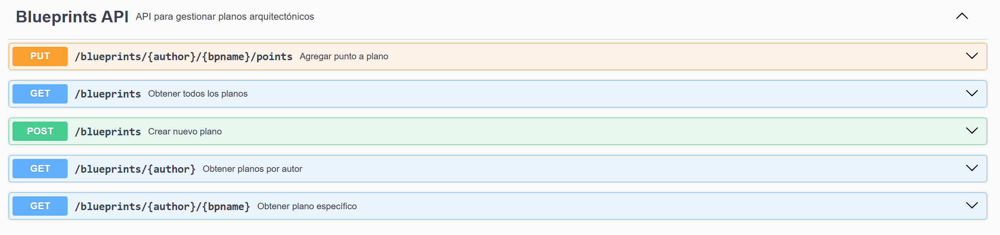
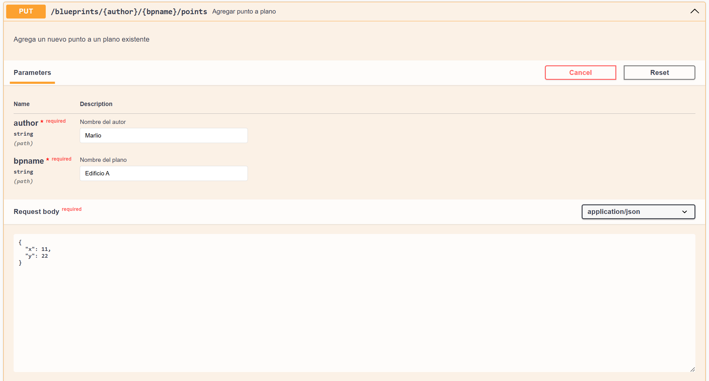
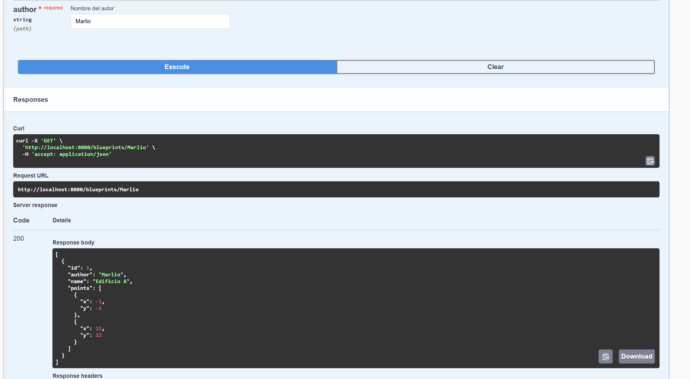
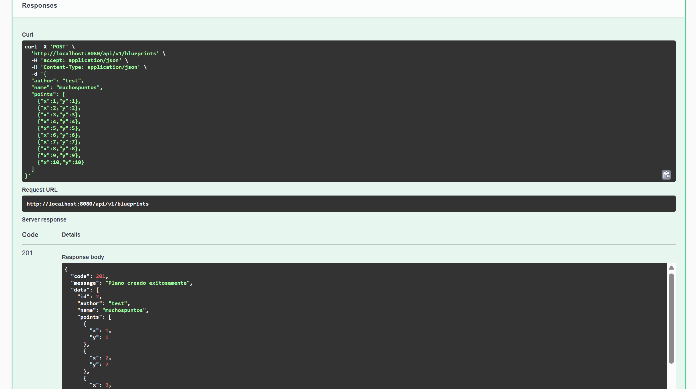

## Laboratorio #4 – REST API Blueprints (Java 21 / Spring Boot 3.3.x)
# Escuela Colombiana de Ingeniería – Arquitecturas de Software  

---

## 📋 Requisitos
- Java 21
- Maven 3.9+

## ▶️ Ejecución del proyecto
```bash
mvn clean install
mvn spring-boot:run
```
Probar con `curl`:
```bash
curl -s http://localhost:8080/api/v1/blueprints | jq
curl -s http://localhost:8080/api/v1/blueprints/john | jq
curl -s http://localhost:8080/api/v1/blueprints/john/house | jq
curl -i -X POST http://localhost:8080/api/v1/blueprints -H 'Content-Type: application/json' -d '{ "author":"john","name":"kitchen","points":[{"x":1,"y":1},{"x":2,"y":2}] }'
curl -i -X PUT  http://localhost:8080/api/v1/blueprints/john/kitchen/points -H 'Content-Type: application/json' -d '{ "x":3,"y":3 }'
```

> Si deseas activar filtros de puntos (reducción de redundancia, *undersampling*, etc.), implementa nuevas clases que implementen `BlueprintsFilter` y cámbialas por `IdentityFilter` con `@Primary` o usando configuración de Spring.
---

Abrir en navegador:  
- Swagger UI: [http://localhost:8080/swagger-ui.html](http://localhost:8080/swagger-ui.html)  
- OpenAPI JSON: [http://localhost:8080/v3/api-docs](http://localhost:8080/v3/api-docs)  

---

## 🗂️ Estructura de carpetas (arquitectura)

```
src/main/java/edu/eci/arsw/blueprints
  ├── model/         # Entidades de dominio: Blueprint, Point
  ├── persistence/   # Interfaz + repositorios (InMemory, Postgres)
  │    └── impl/     # Implementaciones concretas
  ├── services/      # Lógica de negocio y orquestación
  ├── filters/       # Filtros de procesamiento (Identity, Redundancy, Undersampling)
  ├── controllers/   # REST Controllers (BlueprintsAPIController)
  └── config/        # Configuración (Swagger/OpenAPI, etc.)
```

> Esta separación sigue el patrón **capas lógicas** (modelo, persistencia, servicios, controladores), facilitando la extensión hacia nuevas tecnologías o fuentes de datos.

---

## 📖 Actividades del laboratorio

### 1. Familiarización con el código base
- Revisa el paquete `model` con las clases `Blueprint` y `Point`.  
- Entiende la capa `persistence` con `InMemoryBlueprintPersistence`.  
- Analiza la capa `services` (`BlueprintsServices`) y el controlador `BlueprintsAPIController`.

### 2. Migración a persistencia en PostgreSQL
- Configura una base de datos PostgreSQL (puedes usar Docker).  
- Implementa un nuevo repositorio `PostgresBlueprintPersistence` que reemplace la versión en memoria.  
- Mantén el contrato de la interfaz `BlueprintPersistence`.  

#### Cambios realizados:


**Configuración de base de datos (application.yml):**
```yaml
spring:
  datasource:
    url: jdbc:postgresql://localhost:5432/blueprints_db
    username: postgres
    password: postgres
  jpa:
    hibernate:
      ddl-auto: update  # Crea/actualiza tablas automáticamente
    show-sql: true      # Muestra consultas SQL en consola
```

**Entidades modificadas para JPA:**
- **Point**: Clase con anotaciones `@Entity`, `@Id` auto-generado, y relación `@ManyToOne`
- **Blueprint**: Agregadas anotaciones `@Entity`, `@Table`, `@OneToMany`
- Relación bidireccional entre Blueprint y Point

**4. Nuevo repositorio PostgreSQL:**
- `PostgresBlueprintPersistence` con `@Primary`
- Usa `EntityManager` y JPQL para consultas
- `@Transactional` en métodos de escritura

**5. Manejo de transacciones:**
- Agregada anotación `@Transactional` a `saveBlueprint()` y `addPoint()`
- Soluciona error de persistencia en JPA y conflictos de transacciones anidadas
- Método `replacePoints()` optimizado para evitar `UnexpectedRollbackException`

#### 🚀 Cómo ejecutar:

**Levantar PostgreSQL:**
```bash
docker run --name postgres-blueprints -e POSTGRES_PASSWORD=postgres -e POSTGRES_DB=blueprints_db -p 5432:5432 -d postgres:15
```
En caso de ya tenerlo, para iniciarlo:
```bash
docker start postgres-blueprints
```

**Ejecutar aplicación:**
```bash
mvn clean install
mvn spring-boot:run
```

**Probar funcionamiento:**
1. Crear plano via Swagger UI: http://localhost:8080/swagger-ui.html
2. Verificar persistencia: detener y reiniciar aplicación
3. Los datos deben permanecer en PostgreSQL




### 3. Buenas prácticas de API REST
- Cambia el path base de los controladores a `/api/v1/blueprints`.  
- Usa **códigos HTTP** correctos:  
  - `200 OK` (consultas exitosas).  
  - `201 Created` (creación).  
  - `202 Accepted` (actualizaciones).  
  - `400 Bad Request` (datos inválidos).  
  - `404 Not Found` (recurso inexistente).  
- Implementa una clase genérica de respuesta uniforme:
  ```java
  public record ApiResponseDTO<T>(int code, String message, T data) {}
  ```
  Ejemplo JSON:
  ```json
  {
    "code": 200,
    "message": "execute ok",
    "data": { "author": "john", "name": "house", "points": [...] }
  }
  ```

Se transformaron los endpoints para que sigan un formato estándar con versionamiento de API y 
respuestas uniformes mediante una clase genérica ApiResponseDTO que encapsula el código de estado HTTP, un mensaje 
descriptivo y los datos de respuesta. Además, actualizamos todos los códigos HTTP para que sean los adecuados.
Los endpoints ahora están versionados bajo /api/v1/blueprints lo que permite futuras evoluciones de la API sin romper 
compatibilidad, y toda la documentación Swagger fue actualizada para reflejar estos cambios con ejemplos concretos de uso.

### 4. OpenAPI / Swagger
- Configura `springdoc-openapi` en el proyecto.  
- Expón documentación automática en `/swagger-ui.html`.  
- Anota endpoints con `@Operation` y `@ApiResponse`.

### 5. Filtros de *Blueprints* ✅
- Implementa filtros:
  - **RedundancyFilter**: elimina puntos duplicados consecutivos.  
- **UndersamplingFilter**: conserva 1 de cada 2 puntos.  
- **Activación mediante perfiles de Spring**:
  - Perfil `redundancy`: activa RedundancyFilter
  - Perfil `undersampling`: activa UndersamplingFilter
  - Sin perfil: usa IdentityFilter (sin filtrado)

#### 🚀 Cómo activar los filtros:

**Para activar RedundancyFilter:**
```bash
mvn spring-boot:run -Dspring-boot.run.profiles=redundancy
```

**Para activar UndersamplingFilter:**
```bash
mvn spring-boot:run -Dspring-boot.run.profiles=undersampling
```

**Ejecución normal (sin filtrado):**
```bash
mvn spring-boot:run
```

#### Implementación técnica:
- Los filtros implementan la interfaz `BlueprintsFilter`
- Cada filtro está anotado con `@Component` y `@Profile`
- `BlueprintsServices` inyecta el filtro correspondiente según el perfil activo
- El filtro se aplica automáticamente al obtener un blueprint individual (`getBlueprint()`)
 


---

## ✅ Entregables

1. Repositorio en GitHub con:  
   - Código fuente actualizado.  
   - Configuración PostgreSQL (`application.yml` o script SQL).  
   - Swagger/OpenAPI habilitado.  
   - Clase `ApiResponseDTO<T>` implementada.  

2. Documentación:  
   - Informe de laboratorio con instrucciones claras.  
   - Evidencia de consultas en Swagger UI y evidencia de mensajes en la base de datos.  
   - Breve explicación de buenas prácticas aplicadas.  

---

## 📊 Criterios de evaluación

| Criterio | Peso |
|----------|------|
| Diseño de API (versionamiento, DTOs, ApiResponse) | 25% |
| Migración a PostgreSQL (repositorio y persistencia correcta) | 25% |
| Uso correcto de códigos HTTP y control de errores | 20% |
| Documentación con OpenAPI/Swagger + README | 15% |
| Pruebas básicas (unitarias o de integración) | 15% |

**Bonus**:  

- Imagen de contenedor (`spring-boot:build-image`).  
- Métricas con Actuator.

---

## 🎯 Implementación Laboratorio #4

### 📋 Resumen de Implementación

Este laboratorio implementa una API REST completa para gestión de planos arquitectónicos con las siguientes características:

#### **Backend (Spring Boot API)**
- **API RESTful** con endpoints versionados bajo `/api/v1/blueprints`
- **Persistencia en PostgreSQL** con JPA/Hibernate
- **Respuestas estandarizadas** usando `ApiResponseDTO<T>`
- **Documentación automática** con Swagger/OpenAPI
- **Manejo de errores** con códigos HTTP apropiados
- **Filtros de procesamiento** para puntos (Redundancy, Undersampling)
- **Transacciones robustas** con manejo de conflictos

#### **Frontend (React - localhost:5173)**
- **Cliente React** que consume la API REST
- **Interfaz intuitiva** para visualizar y gestionar planos
- **Comunicación CORS** configurada para desarrollo local
- **Visualización de puntos** en plano 2D
- **CRUD completo** de planos y puntos

#### **Base de Datos PostgreSQL**
- **Modelo relacional** con entidades `Blueprint` y `Point`
- **Relación bidireccional** Uno-a-Muchos
- **IDs auto-generados** para evitar conflictos
- **Cascading y orphanRemoval** para integridad referencial

### 🗄️ Configuración Base de Datos

#### **Opción 1: Docker (Recomendado)**
```bash
# Crear y levantar contenedor PostgreSQL
docker run --name postgres-blueprints \
  -e POSTGRES_PASSWORD=postgres \
  -e POSTGRES_DB=blueprints_db \
  -p 5432:5432 \
  -d postgres:15

# Verificar que está corriendo
docker ps | grep postgres-blueprints

# Si ya existe, solo iniciarlo
docker start postgres-blueprints
```

#### **Opción 2: PostgreSQL Local**
```bash
# Conectar a PostgreSQL y crear base de datos
psql -U postgres

CREATE DATABASE blueprints_db;
CREATE USER blueprints_user WITH PASSWORD 'blueprints_pass';
GRANT ALL PRIVILEGES ON DATABASE blueprints_db TO blueprints_user;
\q
```

#### **Verificación de Conexión**
```bash
# Probar conexión con la base de datos
psql -h localhost -p 5432 -U postgres -d blueprints_db

# Verificar tablas creadas (después de iniciar la API)
\dt
```

### 🚀 Ejecución Completa del Sistema

#### **1. Levantar Base de Datos**
```bash
docker start postgres-blueprints
```

#### **2. Iniciar Backend (Puerto 8080)**
```bash
cd LAB3-ARSW-API
mvn clean install
mvn spring-boot:run
```

#### **3. Iniciar Frontend (Puerto 5173)**
```bash
cd [directorio-frontend]
npm install
npm run dev
```

#### **4. Acceder a la Aplicación**
- **Frontend**: http://localhost:5173
- **API Documentation**: http://localhost:8080/swagger-ui.html
- **API Endpoints**: http://localhost:8080/api/v1/blueprints

### 🔧 Problemas Resueltos

1. **Conflictos de Transacciones**: Solucionado `UnexpectedRollbackException` optimizando `replacePoints()`
2. **Primary Key Conflicts**: Cambiado Point de coordenadas a ID auto-generado
3. **Variable Scope**: Resuelto conflicto de nombres en consultas JPA
4. **CORS Configuration**: Configurado para comunicación con frontend en localhost:5173
5. **Data Initialization**: Implementado mecanismo de carga inicial de datos

### 📊 Arquitectura Final

```
Frontend (React:5173) ←→ Backend (Spring Boot:8080) ←→ PostgreSQL:5432
        ↓                           ↓                        ↓
   UI Components              REST Controllers           Tables
   State Management           Services Layer             Entities
   API Calls                 Business Logic             Relations
```  